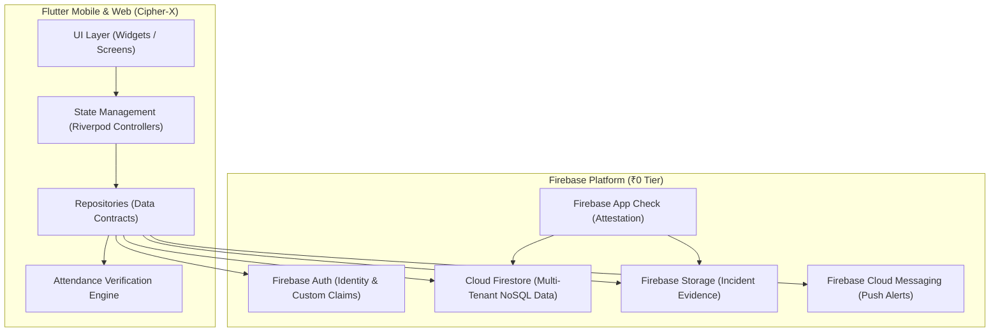

# Cipher-X 🛡️
> **Real-Time Security Workforce & Operations Management Platform**  
> Built by **Team Decrypters** (Hardik, Gauri, Avadhut)

[](LICENSE)
[](https://flutter.dev)
[](https://firebase.google.com)
[](docs/SYSTEM_ARCHITECTURE.md)

---

## 📋 Executive Overview

**Cipher-X** is a startup-quality, production-ready security operations platform designed to solve real-time guard deployment, attendance verification, incident management, and site coverage tracking for corporate and residential security providers.

Traditional security services suffer from **informal shift scheduling, attendance spoofing, delayed incident reporting, and zero real-time visibility**. Cipher-X replaces manual sign-in sheets with a multi-factor verification engine (GPS + Geofence + QR Scanning + Shift Window Validation), live operational dashboards, and real-time incident auditing.

---

## 🎯 Operational Problem & Solution

### Problem
Security companies deploy hundreds of guards daily across disparate locations. Head offices rely on phone calls or WhatsApp messages for attendance, leading to:
- Unverified guard presence (location spoofing).
- Delayed detection of absent or late guards.
- Lack of immutable evidence during security incidents.
- No real-time coverage metric per client site.

### Solution Matrix
Cipher-X introduces a closed-loop operational workflow:

```text
  [ ASSIGN ] ──► [ SHIFT ] ──► [ ARRIVE ] ──► [ VERIFY ] ──► [ CHECK-IN ]
                                                                  │
  [ AUDIT ]  ◄── [ RESOLVE ] ◄── [ INCIDENT ] ◄── [ ALERT ]  ◄────┴── [ MONITOR ]
```

1. **Assign**: Head Office schedules guard shifts mapped to geofenced client sites.
2. **Arrive & Verify**: Guard arrives on-site; system validates GPS distance, accuracy, shift window, and scans site QR code.
3. **Check-In**: Secure, anti-spoofing attendance record generated with server timestamps.
4. **Monitor**: Admin/Supervisor dashboards show live site coverage and guard status.
5. **Alert & Incident**: Automated alerts for late/missed shifts; immediate photo-evidenced incident creation.
6. **Resolve & Audit**: Supervisors review incidents; append-only audit trail logs every critical action.

---

## ✨ Key Features

- **🔐 Multi-Tenant RBAC & Authentication**: Role-based routing for Admin, Supervisor, and Guard with tenant isolation.
- **📍 Multi-Factor Verification Engine**:
  - **GPS + Geofencing**: Haversine distance verification within site radius.
  - **Dynamic QR Validation**: Site-specific QR verification preventing remote check-in.
  - **Shift Window Locking**: Prevents early/late duplicate check-ins outside assigned shift boundaries.
- **📊 Real-Time Operations Dashboard**: High-level metrics for active sites, guard attendance, understaffed sites, and open incidents.
- **🚨 Incident Reporting & Evidence Pipeline**: Guards upload photo evidence directly to Firebase Storage with metadata indexed in Firestore.
- **🔔 Free-Tier Compatible Alerting**: Instant notifications for missed shifts, late check-ins, and critical incidents without paid backend dependencies.
- **🛡️ Immutable Audit Logging**: Complete historical ledger of administrative changes, shift updates, and attendance logs.

---

## 🏗️ System Architecture

Cipher-X is built using a **Feature-First Architecture** in Flutter with **Riverpod** for state management and **Firebase** as a serverless backend ecosystem.



For complete architectural specifications, read [`docs/SYSTEM_ARCHITECTURE.md`](docs/SYSTEM_ARCHITECTURE.md).

---

## 💻 Tech Stack & Infrastructure

Cipher-X is engineered to run **100% on Free-Tier Infrastructure (₹0 Cost)**:

| Layer | Technology | Rationale |
| :--- | :--- | :--- |
| **Frontend Framework** | Flutter 3.x / Dart 3.x | Cross-platform (Android, iOS, Web) codebase for Guard Mobile + Admin Dashboard |
| **State Management** | Flutter Riverpod (`AsyncNotifierProvider`) | Unidirectional data flow, reactive caching, and testability |
| **Routing** | GoRouter | Declarative, role-protected navigation guard pipeline |
| **Data Models** | Freezed + JSON Serializable | Immutable data structures with value equality and JSON codegen |
| **Authentication** | Firebase Auth | Secure identity handling, session persistence, role claims |
| **Database** | Cloud Firestore | Realtime listeners, multi-tenant NoSQL, strict Security Rules |
| **File Storage** | Firebase Storage | Evidence upload storage with strict security rules |
| **Push Notifications**| Firebase Cloud Messaging (FCM) | Realtime operational notifications for alerts |
| **App Security** | Firebase App Check + Security Rules | Client attestation and database-level authorization |

*Strict Constraint*: No Node.js backend, Docker, PostgreSQL, or paid Firebase Cloud Functions required.

---

## 📁 Repository Structure

```text
.
├── CONTRIBUTING.md
├── LICENSE
├── README.md
├── docs/
│   ├── ALERT_SYSTEM.md
│   ├── ATTENDANCE_VERIFICATION.md
│   ├── AUDIT_LOGGING.md
│   ├── DEVELOPMENT_PLAN.md
│   ├── FIRESTORE_SCHEMA.md
│   ├── GIT_WORKFLOW.md
│   ├── INCIDENT_WORKFLOW.md
│   ├── MVP_SCOPE.md
│   ├── PRODUCT_REQUIREMENTS.md
│   ├── SECURITY_MODEL.md
│   ├── SYSTEM_ARCHITECTURE.md
│   ├── TECH_STACK.md
│   └── USER_ROLES.md
└── lib/                        # (Structure outlined for implementation phase)
    ├── app/                    # Entry point, router, theme
    ├── core/                   # Shared services, utilities, widgets, error handling
    └── features/               # Feature-first modules (auth, sites, shifts, attendance, incidents, alerts, dashboard)
```

---

## 👥 Team Decrypters & Ownership Matrix

| Developer | Role | Core Ownership & Integration Focus |
| :--- | :--- | :--- |
| **Hardik** | Tech Lead & Architecture | Overall Architecture, Firebase Setup, Auth & RBAC, Firestore Security Rules, Attendance Verification Engine, Core Integration |
| **Gauri** | Guard Experience Lead | Guard Mobile Application, Today's Shift & Profile UI, Check-In/Check-Out Flow, QR Camera Scanner, Incident Reporting UI |
| **Avadhut** | Admin & Operations Lead | Admin & Operations Dashboard, Guard Management UI, Site & Geofence Management, Shift Scheduler UI, Coverage & Alerts UI |

---

## ⚡ Getting Started & Local Development

### Prerequisites
- [Flutter SDK](https://docs.flutter.dev/get-started/install) (v3.19.0 or higher)
- [Dart SDK](https://dart.dev/get-started) (v3.3.0 or higher)
- [Firebase CLI](https://firebase.google.com/docs/cli) (`npm install -g firebase-tools`)
- VS Code or Android Studio with Flutter/Dart plugins

### Environment Setup

1. **Clone the Repository**:
   ```bash
   git clone https://github.com/kalviumcommunity/-S116-0826-Decrypters-Full-Stack-With-Flutter-Dart-Firebase-CipherX.git
   cd -S116-0826-Decrypters-Full-Stack-With-Flutter-Dart-Firebase-CipherX
   ```

2. **Install Flutter Dependencies**:
   ```bash
   flutter pub get
   ```

3. **Run Static Analysis & Unit Tests**:
   ```bash
   flutter analyze
   flutter test
   ```

4. **Launch the Application**:
   ```bash
   flutter run -d chrome # or attached mobile device
   ```

---

## 📚 Documentation Directory

Explore the complete master documentation suite:

1. 📄 [**Product Requirements Document (PRD)**](docs/PRODUCT_REQUIREMENTS.md)
2. 🏗️ [**System Architecture & Technical Design**](docs/SYSTEM_ARCHITECTURE.md)
3. 🛠️ [**Tech Stack & Free-Tier Budget Specs**](docs/TECH_STACK.md)
4. 👥 [**User Roles & RBAC Matrix**](docs/USER_ROLES.md)
5. 🗄️ [**Firestore Schema & Data Design**](docs/FIRESTORE_SCHEMA.md)
6. 🔒 [**Security Model & Rules Specification**](docs/SECURITY_MODEL.md)
7. 📍 [**Attendance Verification Engine**](docs/ATTENDANCE_VERIFICATION.md)
8. ⚠️ [**Incident Workflow & Evidence Pipeline**](docs/INCIDENT_WORKFLOW.md)
9. 🚨 [**Alert System & Free Automation Architecture**](docs/ALERT_SYSTEM.md)
10. 📝 [**Audit Logging Architecture**](docs/AUDIT_LOGGING.md)
11. 📅 [**10-Day Development Plan**](docs/DEVELOPMENT_PLAN.md)
12. 🔀 [**Git & Branch Workflow Strategy**](docs/GIT_WORKFLOW.md)
13. 🎯 [**MVP Scope Boundaries (Must / Should / Future)**](docs/MVP_SCOPE.md)
14. 🤝 [**Contributor Guidelines**](CONTRIBUTING.md)

---

## 📄 License

This project is open-source under the [MIT License](LICENSE).  
Developed with ❤️ by **Team Decrypters**.