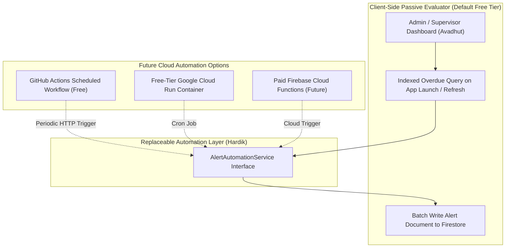

# Cipher-X — Alert System & Free-Tier Automation Architecture 🚨

> **Application Name**: Cipher-X  
> **Founding Team**: Team Decrypters (Hardik, Gauri, Avadhut)  
> **Document Version**: 1.0.0  

---

## 1. Alert Types & Operational Triggers

Cipher-X categorizes alerts into four primary operational trigger classes:

| Alert Trigger | Conditions | Severity Level | Target Recipient | Action Required |
| :--- | :--- | :--- | :--- | :--- |
| **Missed Shift** | Shift start time passed by > 30 mins with zero check-in record. | Critical | Supervisor / Admin | Contact guard or dispatch backup guard. |
| **Late Check-In** | Guard checks in 15–30 mins after scheduled shift start time. | Warning | Supervisor | Acknowledge delay notice. |
| **Understaffed Site** | Active check-in count at site < `requiredGuardCount`. | Critical | Admin | Reassign unassigned guards to site. |
| **Critical Incident**| Guard submits incident report with severity `high` or `critical`. | Critical | Supervisor / Admin | Review photo evidence & dispatch response. |

---

## 2. Free-Tier Automation Architecture (Zero-Paid Cloud Functions)

Firebase Cloud Functions require the paid **Blaze Plan**. To adhere strictly to our **₹0 budget constraint**, Cipher-X decouples alert evaluation from paid backend cloud functions using a **Clean Abstract Automation Interface Pattern**.

### Architecture Blueprint:



---

## 3. Abstract Automation Service Interface (`lib/core/services/`)

The Flutter client and background schedulers interact exclusively through the abstract `AlertAutomationService` interface:

```dart
abstract class AlertAutomationService {
  /// Evaluates scheduled shifts and creates alerts for missed/late check-ins
  Future<void> evaluateShiftAlerts(String organizationId);

  /// Evaluates site staffing requirements against active attendance logs
  Future<void> evaluateSiteCoverage(String organizationId);
  
  /// Dispatches FCM push notifications for critical alerts
  Future<void> dispatchPushNotification({
    required String targetTopicOrToken,
    required String title,
    required String body,
  });
}
```

---

## 4. Passive Evaluation Algorithm

When an Admin or Supervisor opens the Cipher-X Operations Dashboard, the client triggers a background scan of overdue shifts:

```dart
class PassiveAlertEvaluator implements AlertAutomationService {
  final FirebaseFirestore _firestore;

  @override
  Future<void> evaluateShiftAlerts(String organizationId) async {
    final now = DateTime.now();
    final thresholdTime = now.subtract(const Duration(minutes: 30));

    // Query shifts past scheduled start time still marked as 'scheduled'
    final overdueShiftsQuery = await _firestore
        .collection('shifts')
        .where('organizationId', isEqualTo: organizationId)
        .where('status', isEqualTo: 'scheduled')
        .where('startTime', isLessThan: Timestamp.fromDate(thresholdTime))
        .get();

    final batch = _firestore.batch();

    for (final doc in overdueShiftsQuery.docs) {
      // 1. Update Shift status to 'missed'
      batch.update(doc.reference, {'status': 'missed', 'updatedAt': FieldValue.serverTimestamp()});

      // 2. Generate Alert Document
      final alertRef = _firestore.collection('alerts').doc();
      batch.set(alertRef, {
        'organizationId': organizationId,
        'siteId': doc.data()['siteId'],
        'shiftId': doc.id,
        'type': 'missed_shift',
        'message': 'Guard ${doc.data()['guardName']} missed shift at ${doc.data()['siteName']}.',
        'severity': 'critical',
        'isAcknowledged': false,
        'createdAt': FieldValue.serverTimestamp(),
      });
    }

    await batch.commit();
  }
  
  @override
  Future<void> evaluateSiteCoverage(String organizationId) async { ... }
  
  @override
  Future<void> dispatchPushNotification({ ... }) async { ... }
}
```

---

## 5. Free Scheduled Automation Trigger (GitHub Actions)

For automated execution without user interaction, a zero-cost **GitHub Actions Scheduled Workflow** runs every 15 minutes, calling a lightweight script using the Firebase Admin SDK:

```yaml
name: Cipher-X Free Alert Cron
on:
  schedule:
    - cron: '*/15 * * * *'

jobs:
  evaluate-alerts:
    runs-on: ubuntu-latest
    steps:
      - name: Checkout Code
        uses: actions/checkout@v4
      - name: Setup Dart SDK
        uses: dart-lang/setup-dart@v1
      - name: Execute Alert Scanner Script
        env:
          FIREBASE_SERVICE_ACCOUNT: ${{ secrets.FIREBASE_SERVICE_ACCOUNT }}
        run: dart run tool/alert_cron_evaluator.dart
```

This guarantees 24/7 automated alert detection at **₹0 total cost**.
