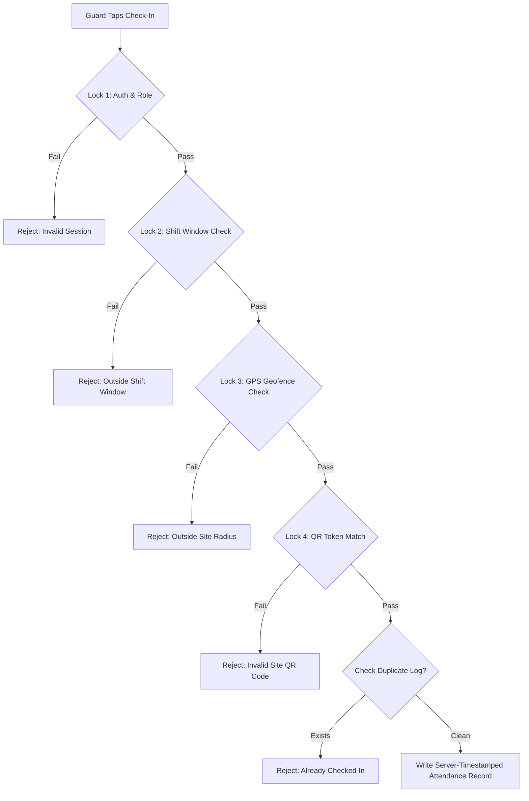

# Cipher-X — Attendance Verification Engine Specification 📍

> **Application Name**: Cipher-X  
> **Founding Team**: Team Decrypters (Hardik, Gauri, Avadhut)  
> **Document Version**: 1.0.0  

---

## 1. Multi-Factor Verification Quad-Lock Architecture

To eliminate attendance fraud, Cipher-X rejects single-button sign-ins (`checkIn = true`). Instead, attendance check-in executes a mandatory **4-Factor Verification Sequence**:



---

## 2. Mathematical Foundation: Haversine Geofencing Formula

To determine if a guard's physical coordinates fall within the site's configured geofence radius without external GIS paid APIs, Cipher-X executes on-device **Haversine Distance Calculation**:

$$\Delta\phi = \text{lat}_2 - \text{lat}_1, \quad \Delta\lambda = \text{lon}_2 - \text{lon}_1$$

$$a = \sin^2\left(\frac{\Delta\phi}{2}\right) + \cos(\text{lat}_1) \cdot \cos(\text{lat}_2) \cdot \sin^2\left(\frac{\Delta\lambda}{2}\right)$$

$$c = 2 \cdot \text{atan2}\left(\sqrt{a}, \sqrt{1-a}\right)$$

$$d = R \cdot c \quad \text{where } R = 6,371,000 \text{ meters}$$

### Dart Haversine Implementation:
```dart
class GeofenceCalculator {
  static const double earthRadiusMeters = 6371000.0;

  static double calculateDistanceMeters({
    required double startLat,
    required double startLon,
    required double endLat,
    required double endLon,
  }) {
    final dLat = _toRadians(endLat - startLat);
    final dLon = _toRadians(endLon - startLon);

    final a = math.sin(dLat / 2) * math.sin(dLat / 2) +
        math.cos(_toRadians(startLat)) *
            math.cos(_toRadians(endLat)) *
            math.sin(dLon / 2) *
            math.sin(dLon / 2);

    final c = 2 * math.atan2(math.sqrt(a), math.sqrt(1 - a));
    return earthRadiusMeters * c;
  }

  static double _toRadians(double degree) => degree * (math.pi / 180.0);
}
```

---

## 3. GPS Accuracy Threshold & Quality Filtering

Low-quality GPS fixes or mock location tools can report fake coordinates. Cipher-X filters coordinates using accuracy tolerances:

1. **Accuracy Threshold**: If `position.accuracy > 35.0` meters, the coordinate is rejected as unreliable. The UI prompts the user: *"Improving GPS accuracy... Please step into an open area."*
2. **Mock Location Detection**: On Android devices, `position.isMocked` is evaluated via `geolocator`. If `isMocked == true`, check-in is instantly aborted and flagged as a security violation in `auditLogs`.

```dart
bool isValidLocationFix(Position position) {
  if (position.isMocked) {
    throw SecurityViolationException('Mock location provider detected.');
  }
  if (position.accuracy > 35.0) {
    throw InaccurateGpsException('GPS accuracy too low (${position.accuracy}m). Need < 35m.');
  }
  return true;
}
```

---

## 4. Dynamic Site QR Token Verification

Each client site document contains an immutable `qrToken` (e.g. `CIPHER_X_SITE_99381_HASH`). Physical QR code plaques are posted at site guard stations.

### Scan Verification Payload:
When Gauri's QR Scanner component scans the plaque, the verification payload is checked:
```json
{
  "siteId": "site_techpark_01",
  "qrToken": "CIPHER_X_SITE_99381_HASH",
  "orgId": "org_decrypters_001"
}
```

Check-in succeeds ONLY if `scannedQrToken == targetSite.qrToken`. This prevents a guard from check-in at home even if GPS was somehow spoofed.

---

## 5. Shift Window Locking

Check-in is permitted only within a valid operational window relative to scheduled shift `startTime`:

$$\text{Window Start} = \text{startTime} - 15 \text{ mins}$$
$$\text{Window End} = \text{startTime} + 30 \text{ mins}$$

- **Too Early** ($< \text{startTime} - 15\text{m}$): *"Shift window has not opened yet. Check-in opens 15 minutes prior to shift."*
- **Late Check-In** ($> \text{startTime} + 30\text{m}$): Check-in is accepted but marked `status: 'flagged'` and triggers a `late_checkin` alert for Supervisors.

---

## 6. Verification Engine Complete Orchestration Flow

```dart
class VerificationEngine {
  final GeolocatorService _locationService;
  final FirestoreRepository _firestoreRepo;

  Future<VerificationResult> verifyAndCheckIn({
    required User guard,
    required Shift shift,
    required Site site,
    required String scannedQrPayload,
  }) async {
    // 1. Shift Window Check
    final now = DateTime.now();
    if (now.isBefore(shift.startTime.subtract(const Duration(minutes: 15)))) {
      return VerificationResult.failed('Shift check-in window not open yet.');
    }

    // 2. Fetch High-Accuracy GPS Position
    final position = await _locationService.getCurrentPosition();
    if (position.isMocked) {
      await _firestoreRepo.logSecurityAlert(guard, shift, 'GPS Mocking Attempted');
      return VerificationResult.failed('Security Alert: Fake GPS detected.');
    }
    if (position.accuracy > 35.0) {
      return VerificationResult.failed('GPS signal too weak (${position.accuracy.toStringAsFixed(1)}m accuracy). Step outside.');
    }

    // 3. Haversine Distance Calculation
    final distance = GeofenceCalculator.calculateDistanceMeters(
      startLat: position.latitude,
      startLon: position.longitude,
      endLat: site.latitude,
      endLon: site.longitude,
    );

    if (distance > site.geofenceRadius) {
      return VerificationResult.failed(
        'Outside site boundary (${distance.toInt()}m away from ${site.name}. Max allowed: ${site.geofenceRadius}m).'
      );
    }

    // 4. QR Token Matching
    final parsedQr = parseSiteQrPayload(scannedQrPayload);
    if (parsedQr.qrToken != site.qrToken || parsedQr.siteId != site.id) {
      return VerificationResult.failed('Invalid QR code scanned for site ${site.name}.');
    }

    // 5. Commit Verified Attendance Document
    await _firestoreRepo.createAttendanceRecord(
      shiftId: shift.id,
      siteId: site.id,
      guardId: guard.uid,
      position: position,
      distance: distance,
      qrToken: parsedQr.qrToken,
    );

    return VerificationResult.success();
  }
}
```
