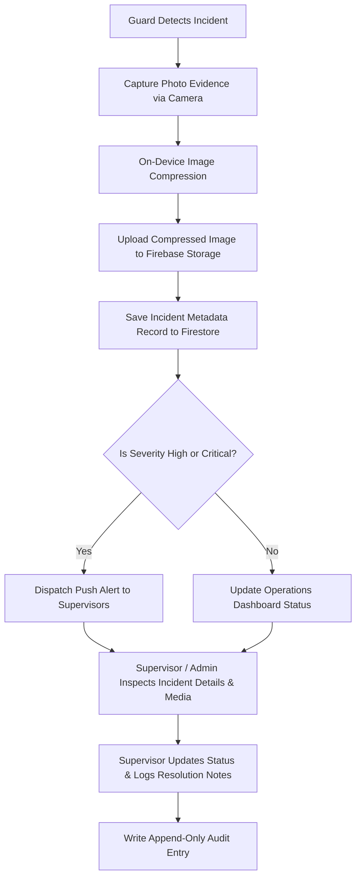

# Cipher-X — Incident Workflow & Evidence Pipeline Specification ⚠️

> **Application Name**: Cipher-X  
> **Founding Team**: Team Decrypters (Hardik, Gauri, Avadhut)  
> **Document Version**: 1.0.0  

---

## 1. Incident Lifecycle & Operational Flow

When an on-site security breach, asset damage, medical emergency, or equipment failure occurs, guards must rapidly create an official, evidenced incident report.



---

## 2. Severity Taxonomy & Classification

| Severity Level | Definition | Examples | SLA Target | Notification Channel |
| :--- | :--- | :--- | :--- | :--- |
| **LOW** | Minor operational anomaly with zero damage or threat. | Broken streetlight, unsecured door unlocked after hours, trash accumulation. | 24 Hours | Dashboard Badge |
| **MEDIUM** | Property damage or non-violent security breach. | Perimeter fence damage, unauthorized parking infraction, equipment malfunction. | 4 Hours | In-App Alert |
| **HIGH** | Active security breach, theft, or property loss. | Break-in attempt, stolen inventory, unauthorized intruder spotted. | 30 Minutes | High-Priority Push Notification |
| **CRITICAL** | Physical violence, fire, severe medical emergency, active hazard. | Physical assault, structure fire, major water leak, active intruder. | Immediate | Urgent Push Alert + Sound Alert |

---

## 3. Evidence Pipeline: Storage vs. Metadata Separation

Binary media files (JPEG/PNG images) must **NEVER be stored inside Cloud Firestore**. Storing base64 encoded strings in Firestore causes database bloat, exceeds 1MB document limits, and skyrockets read costs.

### Architectural Separation:
- **Firebase Storage Path**: Stores compressed binary image files under path:
  `incidents/{incidentId}/evidence/{fileId}.jpg`
- **Firestore Document**: Stores incident metadata and download URL references inside:
  `incidents/{incidentId}`

```text
┌─────────────────────────────────────────────────────────┐
│                    FIREBASE STORAGE                     │
│ Path: incidents/inc_9941/evidence/img_01.jpg            │
│ Content: Binary JPEG Image (Compressed ~250 KB)         │
└────────────────────────────┬────────────────────────────┘
                             │ Download URL Reference
                             ▼
┌─────────────────────────────────────────────────────────┐
│                     CLOUD FIRESTORE                     │
│ Collection: incidents                                   │
│ Document: inc_9941                                      │
│ Data: {                                                 │
│   "id": "inc_9941",                                     │
│   "severity": "critical",                               │
│   "type": "theft",                                      │
│   "evidencePhotoUrls": [                                │
│     "https://firebasestorage.googleapis.com/v0/b/..."   │
│   ],                                                    │
│   "latitude": 12.9716,                                  │
│   "longitude": 77.5946                                  │
│ }                                                       │
└─────────────────────────────────────────────────────────┘
```

---

## 4. On-Device Image Compression Pipeline

Before uploading photos to Firebase Storage, the Flutter client compresses images locally using `flutter_image_compress` to minimize upload bandwidth and stay well within free-tier storage limits:

```dart
class IncidentEvidenceUploader {
  final FirebaseStorage _storage;

  Future<String> compressAndUploadEvidence({
    required String incidentId,
    required File rawImageFile,
  }) async {
    // 1. Compress Image On-Device (Max 1024x1024, 80% quality)
    final compressedBytes = await FlutterImageCompress.compressWithFile(
      rawImageFile.absolute.path,
      minWidth: 1024,
      minHeight: 1024,
      quality: 80,
      format: CompressFormat.jpeg,
    );

    if (compressedBytes == null) {
      throw Exception('Image compression failed.');
    }

    // 2. Define Target Storage Reference Path
    final fileId = const Uuid().v4();
    final storageRef = _storage.ref().child('incidents/$incidentId/evidence/$fileId.jpg');

    // 3. Upload Metadata & Compressed Bytes
    final uploadTask = await storageRef.putData(
      compressedBytes,
      SettableMetadata(contentType: 'image/jpeg'),
    );

    // 4. Return Public Download URL for Firestore Metadata storage
    return await uploadTask.ref.getDownloadURL();
  }
}
```

---

## 5. Resolution & State Transition Audit

Incidents follow strict state transitions: `open` $\rightarrow$ `under_review` $\rightarrow$ `resolved`.

When an Admin or Supervisor resolves an incident, the system executes an atomic batch update:
1. Update `incidents/{incidentId}` document with `status: 'resolved'`, `resolutionNotes`, `resolvedByUserId`, and `resolvedAt`.
2. Write append-only document to `auditLogs` collection documenting the resolution details.
