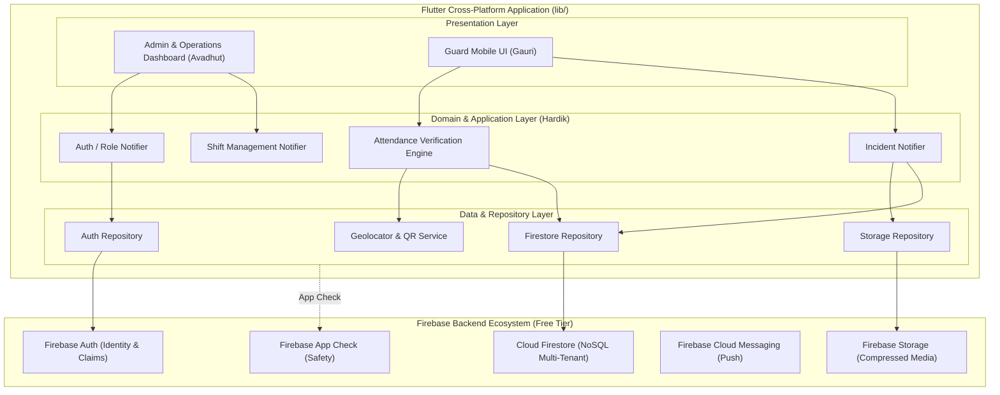

# CipherX — System Architecture & Technical Design 🏗️

> **Application Name**: CipherX  
> **Founding Team**: Team Decrypters (Hardik, Gauri, Avadhut)  
> **Document Version**: 1.0.0  

---

## 1. High-Level System Architecture

CipherX is designed as a **serverless, event-driven multi-tenant mobile/web application** leveraging Flutter for cross-platform clients and Firebase for core backend services under a strict **₹0 budget constraint**.



---

## 2. Flutter Feature-First Directory Structure

The Flutter application strictly adopts a **Feature-First Architecture**, ensuring clear ownership boundaries between Hardik, Gauri, and Avadhut.

```text
lib/
├── main.dart                   # App entrypoint & Firebase initialization
├── app/                        # Global application configuration
│   ├── app.dart                # MaterialApp.router configuration
│   ├── router/                 # GoRouter declarative routes & redirect guards
│   └── theme/                  # Dark/Light glassmorphic theme tokens
│
├── core/                       # Shared code & services (Hardik)
│   ├── constants/              # App strings, Firestore collections, asset paths
│   ├── errors/                 # Failure models & exception handlers
│   ├── services/               # Geolocator, MobileScanner, FCM, Storage services
│   ├── utils/                  # Haversine formula, date formatters, validators
│   └── widgets/                # Common UI components (buttons, loading indicators, cards)
│
└── features/                   # Feature Modules
    ├── auth/                   # Authentication & Role Detection (Hardik)
    │   ├── data/               # AuthRepository, Firebase Auth DTOs
    │   ├── domain/             # UserEntity, UserRole enum
    │   └── presentation/       # LoginScreen, RoleGateWidget
    │
    ├── dashboard/              # Admin Operations Dashboard (Avadhut)
    │   ├── data/               # DashboardStatsRepository
    │   ├── domain/             # CoverageStats, AttendanceMetrics
    │   └── presentation/       # DashboardScreen, MetricsOverviewWidget
    │
    ├── sites/                  # Site & Geofence Management (Avadhut)
    │   ├── data/               # SiteRepository
    │   ├── domain/             # SiteModel, GeofenceRadius
    │   └── presentation/       # SiteListScreen, CreateSiteModal, QRCodeView
    │
    ├── shifts/                 # Shift Scheduling & Roster (Avadhut / Gauri)
    │   ├── data/               # ShiftRepository
    │   ├── domain/             # ShiftModel, ShiftStatus
    │   └── presentation/       # ShiftScheduleScreen, AssignShiftModal, GuardTodayShiftWidget
    │
    ├── attendance/             # Multi-Factor Verification & Check-In (Gauri / Hardik)
    │   ├── data/               # AttendanceRepository
    │   ├── domain/             # AttendanceModel, VerificationResult
    │   └── presentation/       # CheckInScreen, QRScannerWidget, AttendanceHistoryScreen
    │
    ├── incidents/              # Incident Management & Evidence (Gauri / Avadhut)
    │   ├── data/               # IncidentRepository
    │   ├── domain/             # IncidentModel, IncidentSeverity, IncidentStatus
    │   └── presentation/       # CreateIncidentScreen, IncidentDetailScreen, IncidentListScreen
    │
    └── alerts/                 # System & Operational Alerts (Avadhut / Hardik)
        ├── data/               # AlertRepository
        ├── domain/             # AlertModel, AlertType
        └── presentation/       # AlertListWidget, AlertBanner
```

---

## 3. Layered Architectural Separation

Each feature module enforces strict unidirectional dependency flow:

```text
[ Presentation Layer ] ──► [ Domain Layer ] ◄── [ Data Layer ]
  (Widgets, Screens)        (Entities, Models)     (Repositories, DTOs)
```

1. **Presentation Layer**: Built with Flutter UI widgets listening to **Riverpod** state providers (`AsyncNotifierProvider`).
2. **Domain Layer**: Contains immutable entity classes defined using **Freezed** and pure business logic (e.g. shift status calculation). Zero dependencies on Firebase APIs.
3. **Data Layer**: Implements repository interfaces defined in the domain layer. Directly interacts with Firebase SDKs (`cloud_firestore`, `firebase_auth`, `firebase_storage`).

---

## 4. Riverpod State Management Architecture

Riverpod manages all reactive state across CipherX. We strictly standardize on `AsyncNotifierProvider` for robust async handling (loading, data, error).

### Example Notifier Pattern:
```dart
// Domain State Model
@freezed
class AttendanceState with _$AttendanceState {
  const factory AttendanceState({
    required bool isVerifying,
    required bool isWithinGeofence,
    required bool isQrValid,
    String? errorMessage,
  }) = _AttendanceState;
}

// Controller Provider
final attendanceControllerProvider = 
    AsyncNotifierProvider<AttendanceController, void>(AttendanceController.new);

class AttendanceController extends AsyncNotifier<void> {
  @override
  FutureOr<void> build() {}

  Future<void> performCheckIn({
    required String shiftId,
    required String siteId,
    required String qrPayload,
  }) async {
    state = const AsyncValue.loading();
    state = await AsyncValue.guard(() async {
      final repo = ref.read(attendanceRepositoryProvider);
      await repo.executeVerificationAndCheckIn(
        shiftId: shiftId,
        siteId: siteId,
        qrPayload: qrPayload,
      );
    });
  }
}
```

---

## 5. Navigation Guard & Route Protection Pipeline

Navigation is driven by **GoRouter** with dynamic redirect guards evaluating `authProvider`:

```mermaid
flowchart TD
    Request[User Navigates to Route] --> AuthCheck{Is User Authenticated?}
    AuthCheck -- No --> Login[Redirect to /login]
    AuthCheck -- Yes --> RoleCheck{Check User Role}
    RoleCheck -- Admin --> AdminRoutes[/admin/dashboard, /admin/sites, /admin/shifts]
    RoleCheck -- Supervisor --> SupRoutes[/supervisor/coverage, /supervisor/incidents]
    RoleCheck -- Guard --> GuardRoutes[/guard/today-shift, /guard/check-in, /guard/incidents]
```

---

## 6. Offline Resilience & Edge Case Handling

Since security guards often operate in basements or remote industrial sites with spotty cellular coverage, CipherX implements an offline-aware strategy:

1. **Firestore Local Persistence**: Firestore offline caching is enabled (`persistenceEnabled: true`), allowing guards to read assigned shift details even without internet connection.
2. **Transient Failure UI States**: Every repository call maps errors to standardized `Failure` domain objects:
   ```dart
   sealed class Failure {}
   class NetworkFailure extends Failure {}
   class GeofenceFailure extends Failure { final double currentDistance; }
   class InvalidQrFailure extends Failure {}
   ```
3. **Explicit Feedback Loops**: Widgets explicitly render 5 UI states: `Loading`, `Success`, `Empty`, `Error`, `Retry`.

---

## 7. Firebase App Check Integration

To protect Firebase resources from reverse engineering or unauthorized client scripts:
- **Android**: DeviceCheck / Play Integrity API.
- **Web**: reCAPTCHA v3.
- **Firebase Security Rules**: Enforce `request.auth != null && request.app != null` for sensitive write operations.
